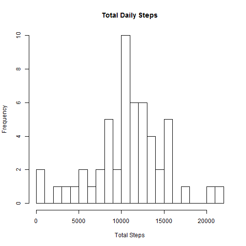
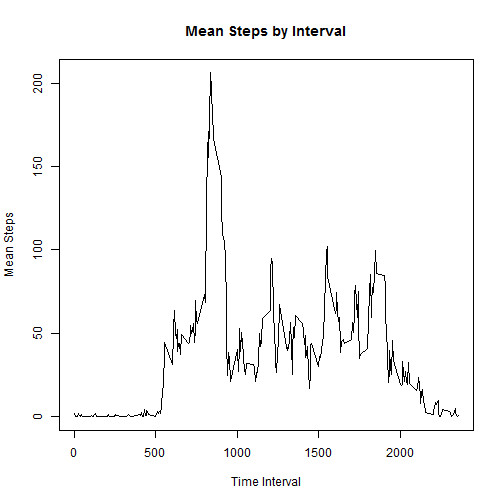
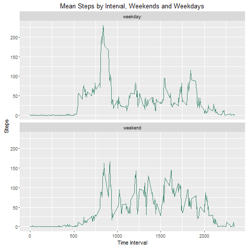

### Read in the data
Here we read in the data and then format the *date* field to be a proper date format instead of character. Note that the usage of "straingsAsFactors=FALSE" kept the date field in character format when reading it in, which simplified the date format conversion.


```r
activity <- read.csv("activity.csv",stringsAsFactors=FALSE)
  activity$date <- as.Date(activity$date,format="%Y-%m-%d")
```

### What is the mean total number of steps taken per day?

**1. Make a histogram of the total number of steps taken each day.**  
First we must compute the mean steps per day. The *aggregate* function can help us with that:


```r
DailyTotal <- with(activity,aggregate(list(steps=steps),list(date=date),sum))
```

Now we can use that dataset to create a histogram of the total daily steps:

```r
hist(DailyTotal$steps, breaks=20, 
      main="Total Daily Steps", xlab="Total Steps", ylab="Frequency")
```



**2. Calculate and report the the mean and median number of steps taken per day.**  
Here we can use the *summary()* function and extract just the 3rd and 4th elements of the result to get the mean and median:


```r
summary(DailyTotal$steps)[c(4,3)]
```

```
##   Mean Median 
##  10770  10760
```
This is a surprising result as it suggests that the distribution of total steps each day is symmetric. This is in keeping with the histogram above.  
  
### What is the average daily activity pattern?  
**1. Make a time series plot of the 5-minute interval (x-axis) and the average number of steps taken, averaged across all days (y-axis).**  
To do this we first aggregate our steps by interval:

```r
IntervalMeans <- with(activity,aggregate(list(meansteps=steps), list(interval=interval), mean,na.rm=T))
```
  
We can then make the plot of mean steps by interval:   

```r
with(IntervalMeans,plot(interval,meansteps,type="l",
                        main="Mean Steps by Interval",
                        ylab="Mean Steps", xlab="Time Interval"))
```


  
**2. Which 5-minute interval, on average across all the days in the dataset, contains the maximum number of steps?**  
Here we can simply return the row(s) that have a value of *meansteps* equal to the maximum value of *meansteps*:  

```r
IntervalMeans[IntervalMeans$meansteps==max(IntervalMeans$meansteps),]
```

```
##     interval meansteps
## 104      835  206.1698
```
  
### Imputing missing values  
  
**1. Calculate and report the total number of missing values in the dataset (i.e. the total number of rows with NAs).**  
This is a fairly straight-forward operation in which we count the number of rows that have a Boolean positive value:  

```r
sum(is.na(activity$steps))
```

```
## [1] 2304
```

**2. Devise a strategy for filling in all of the missing values in the dataset. The strategy does not need to be sophisticated. For example, you could use the mean/median for that day, or the mean for that 5-minute interval, etc.**  
One strategy for imputing the missing data could be to use the interval average. To do this we will split the data into two datasets (missing and non-missing), merge the interval averages onto the missing rows, then replace the missing values with the means.  
  
**3. Create a new dataset that is equal to the original dataset but with the missing data filled in.**  
Merge the missing set with the means and replace the NA values with the floor of the average for that interval. (We use the floor since there are no decimal steps in the original data.)  


```r
impute <- merge(activity,IntervalMeans,by='interval')
  impute$steps[is.na(impute$steps)] <- floor(impute$meansteps)[is.na(impute$steps)]
impute <- impute[,-4]
```
  
**4. Make a histogram of the total number of steps taken each day and calculate and report the mean and median total number of steps taken per day. Do these values differ from the estimates from the first part of the assignment? What is the impact of imputing missing data on the estimates of the total daily number of steps?**  
Now aggregate to daily totals and make the histogram:  

```r
DailyTotal2 <- with(impute,aggregate(list(steps=steps),list(date=date),sum))

hist(DailyTotal2$steps, breaks=20, 
     main="Total Daily Steps - No Missing", xlab="Total Steps", ylab="Frequency")
```


Repeat the mean and median calculation on this dataset:  

```r
summary(DailyTotal2$steps)[c(4,3)]
```

```
##   Mean Median 
##  10750  10640
```
These values are slightly different (lower) than the original values obtained when we ignored the missing data, but overall very close. This is to be expected since we did a simple mean substitution; the grand mean should not change appreciably under this scheme, and the median dropped due to many missing values getting small numbers imputed into them. This "stacks" more data on the low end of the distribution.  
  
###Are there differences in activity patterns between weekdays and weekends?  
**1. Create a new factor variable in the dataset with two levels -- "weekday" and "weekend" indicating whether a given date is a weekday or weekend day.**  
Create factor variable for weekend or weekday:

```r
impute$daytype <- "weekday"
impute$daytype[weekdays(impute$date)=="Saturday" |
                  weekdays(impute$date)=="Sunday"]    <- "weekend"
impute$daytype <- as.factor(impute$daytype)
```
Now we can compute average steps across weekdays:  

```r
IntervalMeans_daytype <- with(impute,aggregate(list(meansteps=steps),
                                             list(interval=interval,daytype=daytype),
                                             mean,na.rm=T))
```
  
**2. Make a panel plot containing a time series plot (i.e. type = "l") of the 5-minute interval (x-axis) and the average number of steps taken, averaged across all weekday days or weekend days (y-axis).**  
Make a panel plot with mean steps per interval in weekdays and weekends using ggplot:  

```r
library(ggplot2)
ggplot(IntervalMeans_daytype, aes(interval,meansteps)) +
       geom_path(color="aquamarine4") +
       facet_wrap(~daytype, nrow=2) + 
       labs(x="Time Interval", y="Steps", title="Mean Steps by Interval, Weekends and Weekdays")
```


